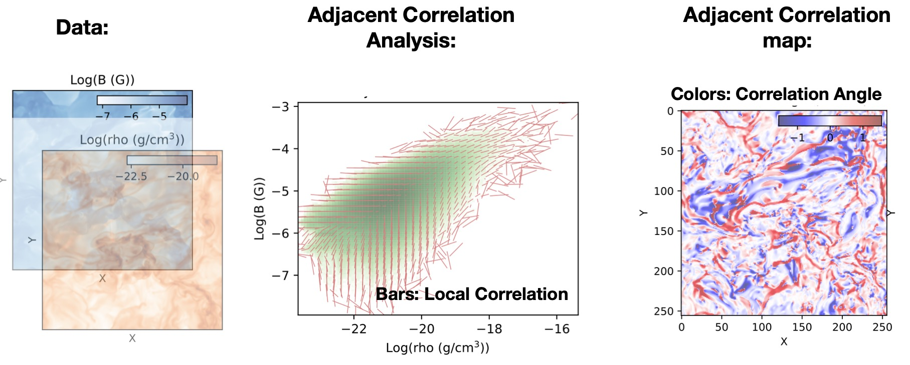
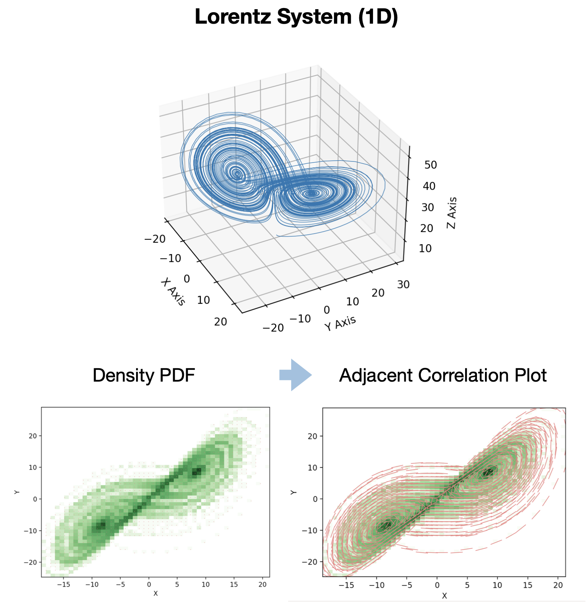
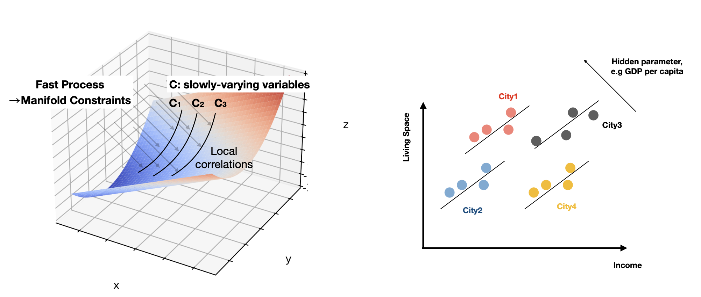
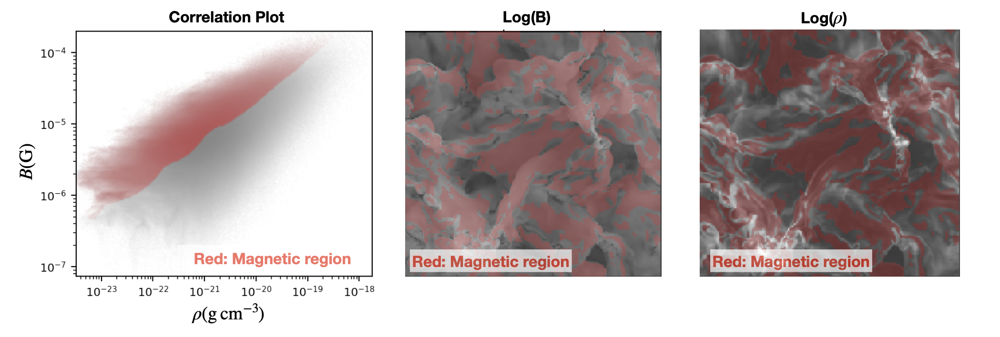

.. -*- mode: rst -*-

======================================================================
Adjacent Correlation Analysis: Revealing Regularities in Image Data
======================================================================

.. .. image:: http://unmaintained.tech/badge.svg
..   :target: http://unmaintained.tech
..   :alt: No Maintenance Intended

.. *Note: This template is not maintained anymore,
.. use the* `tutorial <https://github.com/readthedocs/tutorial-template/>`_ *instead.*

.. $project will solve your problem of where to start with documentation,
.. by providing a basic explanation of how to do it easily.

.. Look how easy it is to use:

..     import project
..     # Get your stuff done
..     project.do_stuff()

Features & Design
------------------
A Python package for performing adjacent correlation analysis on image data. 

The input are images 1 and image 2, in the form of Numpy arrays of the same size. The method is designed to reveal regularities by comparing these images through correlations.

The *adjacent correlation analysis* is performed by calculating and visualizing the *adjacency-induced correlation* in the phase space. The *adjacent correlation map* is a spatially-resolved representation of the correlation between the two images.

The methods are designed to represent the data using correlations, which can be used to perform visualization and interactive data explorations. 

.. _adjacency-correlation-analysis:

------------------------------
Adjacent Correlation Analysis
------------------------------

The  *adjacent correlation analysis* is a method to derive correlation vectors,  which can be plotted on 
top of the density map representing the Probably Density Function (PDF) of the two images data. 

.. image:: images/pdf_aca.png
   :alt: Example of adjacent correlation analysis
   :align: center
   :width: 500px

**The adjacent correlation analysis applied to data from MHD turbulence simulation.**  The output consists of a correlation vector field overlaid on the density map (density PDF). The correlation degree is the normalized length of the vector, and the both the length and the orientation of the vector can be seen in the *adjacent correlation plot*.

**The adjacent correlation analysis applied to the Lorentz system.**  The vectors derived using the adjacent correlation analysis reflects a projected view of the vector field in the phase space on the x-y plane. 

.. _adjacent-correlation-map:

------------------------------
Adjacent Correlation Map
------------------------------
The *adjacent correlation map* is a method to provide maps of the correlation between the two images. It contains a correlation angle map, a map of the correlation degree, and a correlation coefficient map.

.. image:: images/adjacent_correlation_map.png
   :alt: Example of adjacent correlation map
   :align: center
   :width: 500px

**The adjacent correlation map applied to temperature and precipitation data.**   The output consists of a correlation angle map, a map of the correlation degree, and a correlation coefficient map (available as the program output). The correlation angle map shows the direction of the correlation in the phase space, while the correlation degree map shows the strength of the correlation. *Different colors represent different ways temperature T,x  and log(percipation) are correlated*.

------------------------------
References:
------------------------------

If you make use of this software for your work we would appreciate it if you would cite the papers:

Adjacent Correlation Analysis:

*  *Revealing hidden correlations from complex spatial distributions: Adjacent Correlation Analysis， Li (2025)*

Adjacent Correlation Map:

* *Mapping correlations and coherence: adjacency-based approach to data visualization and regularity discovery， Li (2025)*

.. _installation-usage:

Installation & Usage
-----------------------

-------------
Requirements:
-------------

* Python 3.0 or higher
* NumPy
* SciPy
* Matplotlib

Installation can be done using pip:

.. code:: bash
  
  pip install adjacent-correlation-analysis

or by cloning the repository and running:

.. code:: bash
  
  git clone

-----------
How to use 
-----------

To perform the **adjacent correlation analysis**, you can use the following code:

.. code-block:: python

   import adjacency_correlation_analysis as aca
   aca.adjacent_correlation_plot(xdata, ydata)
   plt.show()

which computes the corelation vector, and generates a plot of the correlation vectors overlaid on the density density constructed from the two images.

There are a number of parameters

   - ``bins:`` Number or sequence of bins used to compute the histogram for density estimation. 
              If None, an optimal bin size is automatically determined. Defaults to None.
   -   ``ax:`` matplotlib axes object. Defaults to plt.gca().
   -   ``scale, cmap, etc.``: plotting parameters.
   -   ``**kwargs``: Additional arguments for :code:`matplotlib.pyplot.imshow` and :code:`quiver`.
   -   ``cmap:`` colormap to be used. Defaults to 'viridis'.
   -   ``facecolor:`` facecolor of the quiver arrows. Defaults to 'w'.
   -   ``scale:`` scaling factor for the quiver arrows. Defaults to 20.
   -   ``lognorm:`` whether to use logarithmic normalization for the density map. Defaults to False.

To compute the adjacent correlation vectors, one can also use

.. code:: python

   import numpy as np
   import adjacency_correlation_analysis as aca
   H, xedges, yedges = np.histogram2d(xdata, ydata)
   ex, ey = aca.compute_correlation_vector(xdata, ydata, xedges, yedges)

where the input

- ``xdata`` and ``ydata`` are the two images (Numpy arrays) to be compared.
- ``xedges`` and ``yedges`` are the edges of the bins used to compute the histogram for density estimation.

The output is a tuple containing:

- ``p``: Degree of correlation 
- ``nx``: x-component of the correlation vector (normalized)
- ``ny``: y-component of the correlation vector (normalized)

- ``i``: total intensity of the correlation vector. i = (Ex**2 + Ey**2)**0.5, Ex = d p_1 / d x, Ey = d p_2 / d x

To visualize the result:

.. code:: python

   import matplotlib.pyplot as plt
   xx = np.linspace(xedges[0], xedges[-1], len(xedges)-1)
   yy = np.linspace(yedges[0], yedges[-1], len(yedges)-1)
   x_grid, y_grid = np.meshgrid(xx, yy)
    
    # Plotting the result
   plt.quiver(x_grid, y_grid, ex.T, ey.T, facecolor='w',angles='xy',scale=30,headaxislength=0)

   
To compute the **adjacent correlation map**

.. code:: python

   import adjacency_correlation_analysis as aca
   p, angle, corr_coef, i = aca.compute_correlation_map(xdata, ydata)

where the input
- ``xdata`` and ``ydata`` are the two images (Numpy arrays) to be compared.

The output is a tuple containing:

 - ``p``: the correlation degree map, which is the normalized length of the correlation vector, p = (l_max / (l_min**2 + l_max**2)**0.5)
 - ``angle``: the correlation angle map, which is the direction of the correlation in the phase space, angle = np.arctan2(Ey, Ex)
 - ``corr_coef``: the correlation coefficient map, which is equivalent to the Pearson correlation coefficient.
 - ``i``: the intensity map, which is the total gradient in the phase space,  i = (Ex**2 + Ey**2)**0.5, Ex = d p_1 / d x, Ey = d p_2 / d x

To visualize the result:

.. code:: python

   import matplotlib.pyplot as plt
   plt.imshow(p)
   plt.imshow(angle)
   plt.show()

Foundation of Adjacent Correlation Analysis
--------------------------------------------

.. _adjacency-induced-correlations:

--------------------------------
Adjacency-induced correlations:
--------------------------------

The method is based on the observation that image values measured in adjacent locations often exhibit stronger correlations compared to image values measured over the whole region. Take the following example of the temperature and perception data from the North America:  When plotted together, we reveal a phase space where temperature and precipitation are not well-correlated. To reveal regularities, we choose three boxes (R1, R2 and R3) at different locations. From the west to the east, the temperature and precipitation exhibit correlations ranging from negative, to positive, then to weak correlations. These local correlations are undermined in the global correlation plot. 

.. image:: images/adjacency_induced.png
   :alt: Adjacent Correlation Map
   :align: center
   :width: 500px

**Adjacency-induced correlations:** Values measured in small boxes, R1, R2, and R3 are stronger than correlations measured over the whole region.  

The *adjacent correlation analysis* is a method to reveal these local correlations in the phase space. The *adjacent correlation map* provide maps of correlations in the space were the quantities are measured. 

Given two images, :math:`p_1(x, y)` and :math:`p_2(x, y)`, the *adjacency correlation map* contains a correlation angle map,

.. math::
  \theta(x,y) = \arctan(\frac{ d p_2}{d p_1})

a map of the correlation degree:

.. math::
   p(x,y) = \frac{l_{max}}{(l_{min}^2 + l_{max}^2)^{1/2}}

where :math:`l_{min}` and :math:`l_{max}` are the minimum and maximum lengths of the correlation ellipse, and a correlation coefficient map:

.. math::
   r(x,y) = \frac{\sigma(p_1 p_2)}{ \sigma(p_1) \sigma(p_2)}

which is the equivalent to the Pearson correlation coefficient.

The *adjacent correlation plot* is a representation of these correlations in the phase space.

-------------------------------------------------
Superimpose correlations using Stokes parameters
-------------------------------------------------

To superimpose the adjacent correlation vectors, we can use Stokes parameters. The Stokes parameters are a set of four parameters that describe the polarization state of light. In this case, we can use them to represent the correlation vectors.

In the :math:`p_1-p_2` space, the correlation vector is 

.. math::
       \vec{E} = (E_x, E_y) = ({d} p_1, {d} p_2)

where the pseudo-Stokes parameters are defined as:

.. math::
  I = \frac{1}{2} (E_x^2 + E_y^2) \\
  Q = \frac{1}{2} (E_x^2 - E_y^2)\\
  U = E_x E_y\\

The stokes parameters are used to superimpose these correlation vectors, and in the last step, the correlation angle and degree can be computed from the stokes parameter using 

.. math::
      \theta = \frac{1}{2} \arctan \left( \frac{U}{Q} \right)

    p = \left( \left( Q/I\right)^2 + \left(U/I\right)  \right)^{1/2}

From which, :math:`E_x` and :math:`E_y` can be computed. 

.. image:: images/stokes.png
   :alt: Stokes Parameters
   :align: center
   :width: 500px

-------------------------
Manifold Interpretation:
-------------------------

What do the lines seen in the adjacent correlation plot mean?

For a system controlled by a series of PDEs, a fast process will restrict the system to a low-dimensional manifold in the phase space, where the local variations can be described by a (spin-2) vector field on this manifold. The existence of some slow variables ($C$) might serve the role of separating different trajectories, which correspond to different spatially coherent regions. 

Consider the correlation between income and the size of the apartment, when measured in a localized regions, families with larger income tend to live in larger apartments, and visa versa. However, when considering the whole country, the correlation between income and apartment size is weak. This is because the size of the apartment is not only a function of the income, but also depends on other hidden parameters, such as GDP per capita, city, size, etc... This hidden, slow-changing parameters, when not measured, can induce these local correlations.

*The correlation vectors thus follow lines of constant C, where C is a hidden, slow-varying parameter.*

Interactive Data Exploration:

It is advertised to  use softwares such as Glue \url{https://glueviz.org/}, to visualize the data.

**Interactive Data Exploration.**

Contribute
----------

- Issue Tracker: github.com/Adjacent-Correlation-Analysis/issues
- 
- Source Code: github.com/Adjacent-Correlation-Analysis

Support
----------

If you are having issues, please let us know.
We have a mailing list located at: https://groups.google.com/g/adjacentcorrelationanalysis

Citation
--------
If you make use of this software for your work we would appreciate it if you would cite the paper:

Adjacent Correlation Analysis:

- Revealing hidden correlations from complex spatial distributions: Adjacent Correlation Analysis， Li 2025

Adjacent Correlation Map:

- Mapping correlations and coherence: adjacency-based approach to data visualization and regularity discovery， Li 2025

License
-------

The project is licensed under the BSD license.

