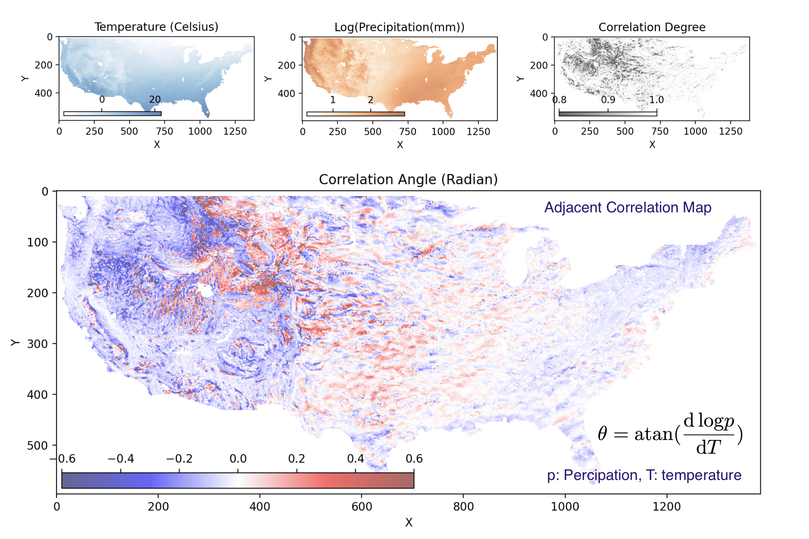
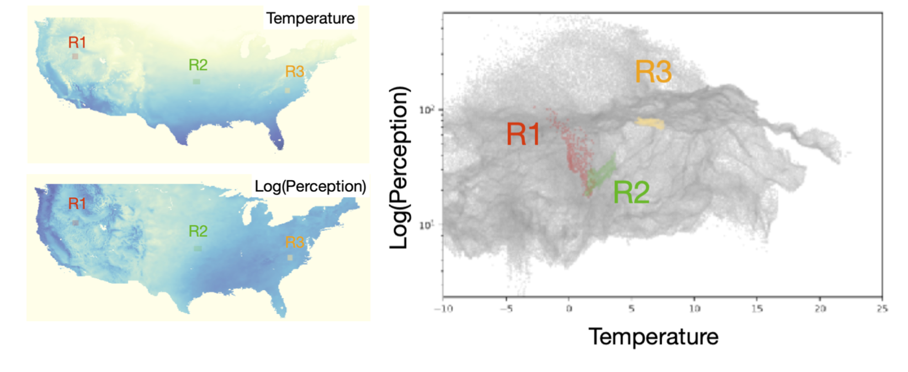
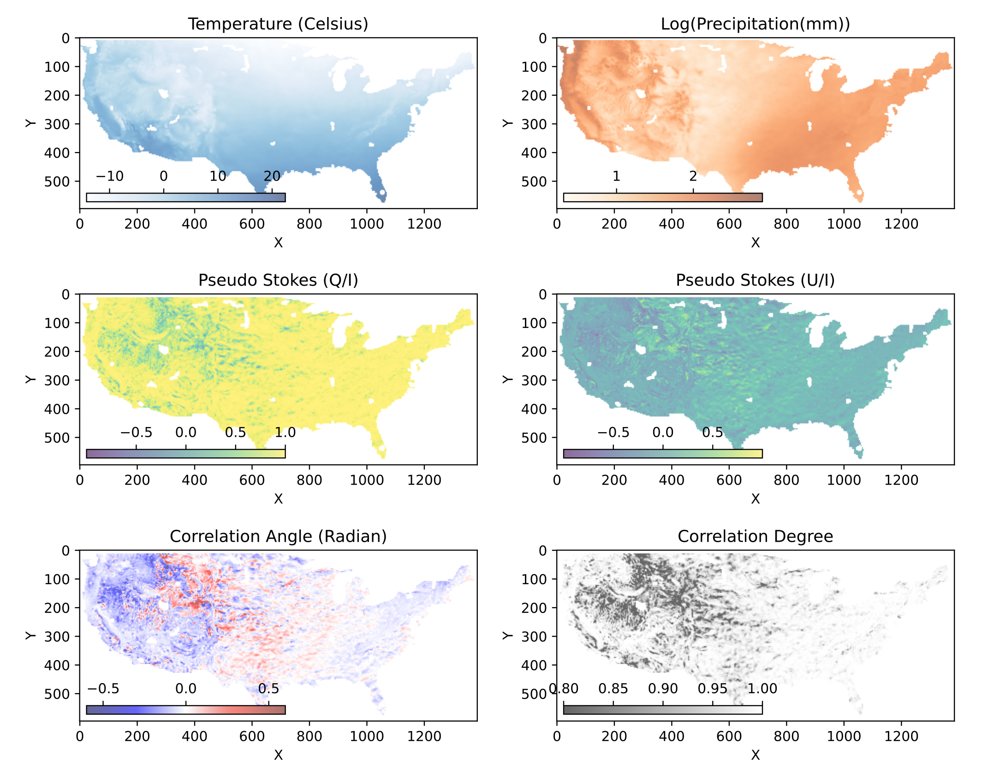

======================================================================
Adjacent Correlation Analysis: Revealing Regularities in Image Data
======================================================================

.. .. image:: http://unmaintained.tech/badge.svg
..   :target: http://unmaintained.tech
..   :alt: No Maintenance Intended

.. *Note: This template is not maintained anymore,
.. use the* `tutorial <https://github.com/readthedocs/tutorial-template/>`_ *instead.*

.. $project will solve your problem of where to start with documentation,
.. by providing a basic explanation of how to do it easily.

.. Look how easy it is to use:

..     import project
..     # Get your stuff done
..     project.do_stuff()

Features & Design
------------------
A Python package for performing adjacent correlation analysis on image data. 

The input are images 1 and image 2, in the form of Numpy arrays of the same size. The method is designed to reveal regularities by comparing these images and constructing correlations.

The adjacent correlation analysis is performed by calculating and visualizing the adjacency-induced correlation in the phase space. The adjacent correlation map is a spatially-resolved representation of the correlation between the two images.

The  *adjacent correlation analysis* is a method to derive correlation vectors,  which can be plotted on 
top of the density map representing the Probably Density Function (PDF) of the two images data. 

**The adjacent correlation analysis applied to data from MHD turbulence simulation.**  The output consists of a correlation vector field overlaid on the density map. The correlation degree is the normalized length of the vector, and the both the length and the orientation of the vector can be seen in the *adjacent correlation plot*

The *adjacent correlation map* is a method to provide maps of the correlation between the two images. It contains a correlation angle map, a map of the correlation degree, and a correlation coefficient map.

**The adjacent correlation map applied to temperature and precipitation data.**  The output consists of two maps: the correlation angle map and the correlation degree map. The correlation angle map shows the direction of the correlation in the phase space, while the correlation degree map shows the strength of the correlation. The correlation coefficient map is also provided, which is equivalent to the Pearson correlation coefficient.

The method is fairly fast: both the adjacency correlation analysis and the adjacency correlation map have :math:`o(N)` complexity, which makes them useful for large datasets. 

If you make use of this software for your work we would appreciate it if you would cite the paper:

Adjacent Correlation Analysis:

* Revealing hidden correlations from complex spatial distributions: Adjacent Correlation Analysis， Li (2025)

Adjacent Correlation Map:

* Mapping correlations and coherence: adjacency-based approach to data visualization and regularity discovery， Li (2025)

Installation & Usage
-----------------------

-------------
Requirements:
-------------

* Python 3.0 or higher
* NumPy
* SciPy
* Matplotlib

Installation can be done using pip:

.. code:: bash
  
  pip install adjacent-correlation-analysis

or by cloning the repository and running:

.. code:: bash
  
  git clone

-----------
How to use 
-----------
To use the adjacent correlation analysis, you can import the necessary libraries and the module as follows:

.. code:: python

    import adjacency_correlation_analysis as aca

To perform adjacent correlation analysis, you can use the following code:

.. code:: python

    import numpy as np

There are a number of parameters

 -  ``n_neighbors``: This determines the number of neighboring points used in
    local approximations of manifold structure. Larger values will result in
    more global

.. code:: python

   import adjacency_correlation_analysis as aca

To produce an adjacency correlation map, you can use the following code:

.. code:: python

   import numpy as np

and plot the result using Matplotlib:

.. code:: python

   import matplotlib.pyplot as plt

Foundation of Adjacent Correlation Analysis
--------------------------------------------

--------------------------------
Adjacency-induced correlations:
--------------------------------

The method is based on the observation that image values measured in adjacent locations often exhibit stronger correlations compared to image values measured over the whole region. Take the following example of the temperature and perception data from the North America:  When plotted together, we reveal a phase space where temperature and precipitation are not well-correlated. To reveal regularities, we choose three boxes (R1, R2 and R3) at different locations. From the west to the east, the temperature and precipitation exhibit correlations ranging from negative, to positive, then to weak correlations. These local correlations are undermined in the global plot, and hard to be revealed otherwise.

The *adjacent correlation analysis* is a method to reveal these local correlations in the phase space. The *adjacent correlation analysis* provide vectors fields in the $p_1$-$p_2$ space to represent those correlations,

The *adjacent correlation map* is method to provide maps of the correlation between the two images. Given two images, :math:`p1(x, y)` and :math:`p2(x, y)`, the adjacency correlation map contains a correlation angle map,

.. math::
  \theta(x,y) = \arctan(\frac{ d p_2}{d p_1})

a map of the correlation degree:

.. math::
   p(x,y) = \frac{l_{max}}{(l_{min}^2 + l_{max}^2)^{1/2}}

where :math:`l_{min}` and :math:`l_{max}` are the minimum and maximum lengths of the correlation ellipse, and a correlation coefficient map:

.. math::
   r(x,y) = \frac{\sigma(p_1 p_2)}{ \sigma(p_1) \sigma(p_2)}

which is the equivalent to the Pearson correlation coefficient.

-------------------------------------------------
Superimpose correlations using Stokes parameters
-------------------------------------------------

To superimpose the adjacent correlation vectors on the density map, we can use Stokes parameters. The Stokes parameters are a set of four parameters that describe the polarization state of light. In this case, we can use them to represent the correlation vectors in the phase space.

In the :math:`p_1-p_2` space, the correlation vector is 

.. math::
       \vec{E} = (E_x, E_y) = ({d} p_1, {d} p_2)

where the pseudo-Stokes parameters are defined as:

.. math::
  I = \frac{1}{2} (E_x^2 + E_y^2) \\
  Q = \frac{1}{2} (E_x^2 - E_y^2)\\
  U = E_x E_y\\

The stokes parameters are used to superimpose these correlation vectors, and in the last step, the correlation angle and degree can be computed from the stokes parameter using 

.. math::
      \theta = \frac{1}{2} \arctan \left( \frac{U}{Q} \right)

    p = \left( \left( Q/I\right)^2 + \left(U/I\right)  \right)^{1/2}

From which, :math:`E_x` and :math:`E_y` can be computed. 

----------
Contribute
----------

- Issue Tracker: github.com/Adjacent-Correlation-Analysis/issues
- Source Code: github.com/Adjacent-Correlation-Analysis

----------
Support
----------

If you are having issues, please let us know.
We have a mailing list located at: https://groups.google.com/g/adjacentcorrelationanalysis

--------
Citation
--------
If you make use of this software for your work we would appreciate it if you would cite the paper:

Adjacent Correlation Analysis:

- Revealing hidden correlations from complex spatial distributions: Adjacent Correlation Analysis， Li 2025

Adjacent Correlation Map:

- Mapping correlations and coherence: adjacency-based approach to data visualization and regularity discovery， Li 2025

-------
License
-------

The project is licensed under the BSD license.

