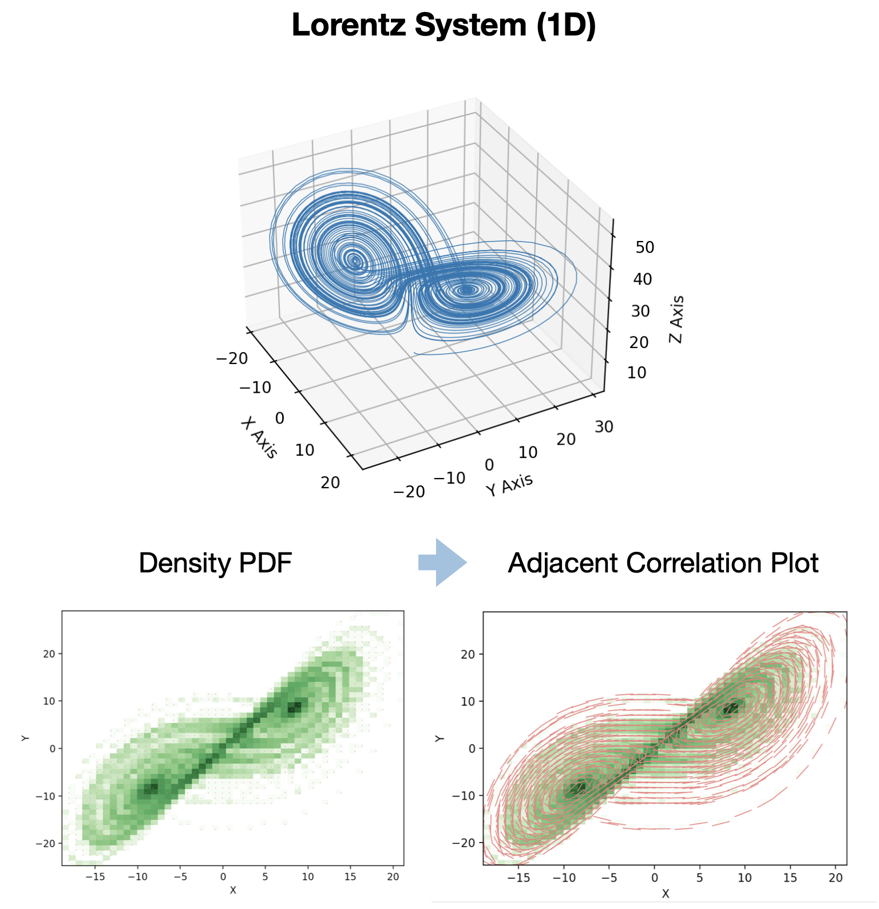
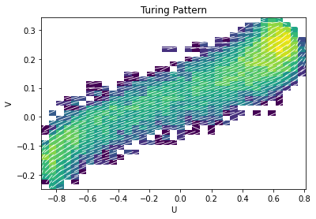

.. -*- mode: rst -*-

Adjacent Correlation Analysis: Spatially-aware 2D histograms for data visualization
************************************************************************************

Let's walk through how to perform an adjacent correlation analysis using the `adjacent_correlation_analysis` package. We'll use example data representing a **Turing pattern**, specifically the activator (U) and inhibitor (V) concentrations.

------------------------------
Adjacent Correlation Analysis
------------------------------

The  *adjacent correlation analysis* is a method to derive correlation vectors,  which can be plotted on 
top of the density map representing the Probably Density Function (PDF) of the two images data. 

**The adjacent correlation analysis applied to data from MHD turbulence simulation.**  The output consists of a correlation vector field overlaid on the density map (density PDF). The correlation degree is the normalized length of the vector, and the both the length and the orientation of the vector can be seen in the *adjacent correlation plot*.

**The adjacent correlation analysis applied to the Lorentz system.**  The
vectors derived using the adjacent correlation analysis reflects a projected
view of the vector field in the phase space on the x-y plane. 

------------------------------
Example
------------------------------

### Data Loading and Visualization

First, we need to load our image data. These are 2D NumPy arrays, where each element represents the concentration at a specific spatial location. In this example, we'll download these arrays, which represent Turing patterns.

.. code:: ipython3

    import numpy as np
    import adjacent_correlation_analysis as aca
    import matplotlib.pyplot as plt
    from matplotlib.colors import LogNorm # For logarithmic normalization in plots
    import wget # To download example data; install with: pip install wget

    # Download the activator (U) and inhibitor (V) concentration data
    url_u = "https://github.com/gxli/Adjacent-Correlation-Analysis/blob/main/tests/turing_pattern_U.npy"
    wget.download(url_u)

    url_v = "https://github.com/gxli/Adjacent-Correlation-Analysis/blob/main/tests/turing_pattern_V.npy"
    wget.download(url_v)

    # Load the data into NumPy arrays
    data_u = np.load('./turing_pattern_U.npy')
    data_v = np.load('./turing_pattern_V.npy')

Now, let's visualize these two concentration maps to get a sense of the input data.

.. code:: ipython3

    plt.figure(figsize=(10, 5)) # Set figure size for better display
    plt.subplot(121)
    plt.imshow(data_u, cmap='viridis') # Use a colormap for better visualization
    plt.title('Activator Concentration (U)') # More descriptive label
    plt.colorbar(label='Concentration') # Add colorbar
    
    plt.subplot(122)
    plt.imshow(data_v, cmap='magma') # Use a different colormap
    plt.title('Inhibitor Concentration (V)') # More descriptive label
    plt.colorbar(label='Concentration') # Add colorbar
    plt.tight_layout() # Adjust layout to prevent overlap
    plt.show()

.. image:: _static/aca/output_3_1.png

---

### Method 1: Using `adjacent_correlation_plot`

The `adjacent_correlation_plot` function provides a convenient way to directly generate the **adjacent correlation plot**, overlaying correlation vectors onto the density map in phase space. This method is ideal for quick visualization of the overall correlation structure.

.. code:: ipython3

    # Generate the adjacent correlation plot
    # R is a tuple containing raw correlation data or matrices, depending on the function's internal design.
    Ex, Ey, xedges, yedges, R = aca.adjacent_correlation_plot(
        data_u, data_v, bins=35, cmap='viridis', facecolor='w', scale=20, lognorm=True
    )
    
    # Customize the plot
    ax = plt.gca()
    ax.set_xlabel('Activator Concentration (U)') # More descriptive label
    ax.set_ylabel('Inhibitor Concentration (V)') # More descriptive label
    ax.set_title('Adjacent Correlation Plot for Turing Pattern')
    plt.show()

---

### Method 2: Using `compute_correlation_vector` for Custom Plotting

For more granular control over plotting, you can first compute the correlation vectors using the `compute_correlation_vector` function. This approach gives you the flexibility to add custom background plots, combine with other visualizations, or analyze the vectors numerically.

.. code:: ipython3

    plt.figure(figsize=(8, 7)) # Adjust figure size

    # First, create the 2D histogram (density map) as a background
    h, xedges, yedges, im = plt.hist2d(
        data_u.flatten(), data_v.flatten(), bins=35, norm=LogNorm(), cmap='Greys' # Use LogNorm and a grayscale colormap for background
    )
    plt.colorbar(label='Density (Log Scale)') # Add colorbar for density
    
    # Compute the correlation vectors
    ex, ey = aca.compute_correlation_vector(data_u, data_v, xedges, yedges)
    
    # Prepare the grid for plotting vectors
    xx = np.linspace(xedges[0], xedges[-1], len(xedges)-1)
    yy = np.linspace(yedges[0], yedges[-1], len(yedges)-1)
    x_grid, y_grid = np.meshgrid(xx, yy)
    
    # Plotting the correlation vectors using quiver
    plt.quiver(
        x_grid, y_grid, ex.T, ey.T, # Transpose ex, ey for correct orientation if needed by your data
        angles='xy', scale=30, headaxislength=0, # Customize quiver appearance
        color='red' # Set arrow color to red for better visibility against grayscale background
    )
    
    plt.xlabel('Activator Concentration (U)') # Add axis labels
    plt.ylabel('Inhibitor Concentration (V)')
    plt.title('Adjacent Correlation Vectors on Density Map') # Add a title
    plt.grid(True, linestyle=':', alpha=0.6) # Add a subtle grid
    plt.show()

.. image:: _static/aca/output_7_1.png

---

### Visualizing the Correlation Degree ($p$)

The **correlation degree** $p$ represents the normalized length of the correlation vector, indicating the strength of the local correlation. We can calculate and visualize it as a spatial map, providing insights into where correlations are strongest in the phase space.

The correlation degree $p$ is given by:

.. math::
   p = \sqrt{e_x^2 + e_y^2}

where $e_x$ and $e_y$ are the components of the normalized correlation vector.

.. code:: ipython3

    # Calculate the correlation degree map
    p = np.sqrt(ex**2 + ey**2) # Using the ex, ey computed in the previous step
    
    plt.figure(figsize=(8, 6)) # Adjust figure size
    
    # Define the extent for the imshow plot to match the bin edges
    myextent = [xedges[0], xedges[-1], yedges[0], yedges[-1]]
    
    plt.imshow(p.T, origin='lower', extent=myextent, aspect='auto', cmap='plasma') # Use a colormap like 'plasma'
    plt.title('Correlation Degree Map: $p = \\sqrt{e_x^2 + e_y^2}$') # Use LaTeX for the title
    plt.xlabel('Activator Concentration (U)') # Add axis labels
    plt.ylabel('Inhibitor Concentration (V)')
    plt.colorbar(label='Correlation Degree ($p$)') # Add a colorbar with label
    plt.show()

.. image:: _static/aca/output_9_1.png