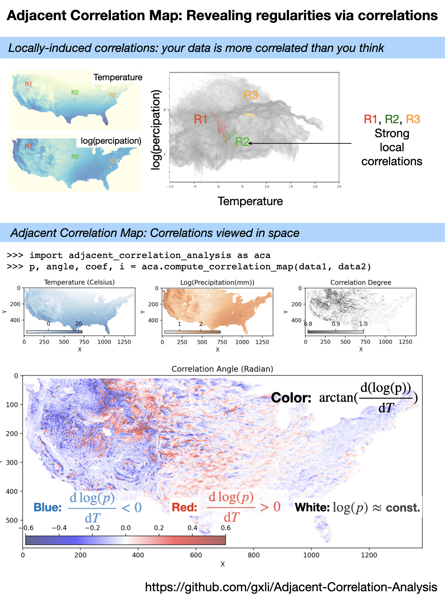

Adjacent Correlation Map: Visualizing Correlations between Quantities
*************************************************************************************

------------------------------
Adjacent Correlation Map
------------------------------
The *adjacent correlation map* is a method to provide maps of the correlation between the two images. It contains a correlation angle map, a map of the correlation degree, and a correlation coefficient map.

------------------------------
Example
------------------------------

**The adjacent correlation map applied to temperature and precipitation data.**
The output consists of a correlation angle map, a map of the correlation degree,
and a correlation coefficient map (available as the program output). The
correlation angle map shows the direction of the correlation in the phase space,
while the correlation degree map shows the strength of the correlation.
*Different colors represent different ways temperature T,x  and log(percipation)
are correlated*.

This example shows how to compute and visualize the adjacent correlation
map.

.. code:: ipython3

    import adjacent_correlation_analysis as aca
    import numpy as np
    import matplotlib.pyplot as plt

Load the data

.. code:: bash

    wget https://github.com/gxli/Adjacent-Correlation-Analysis/blob/main/tests/NOAA_perc.npy
    wget https://github.com/gxli/Adjacent-Correlation-Analysis/blob/main/tests/NOAA_temp.npy

.. code:: ipython3

    data_temp = np.load('./NOAA_temp.npy')
    data_perc = np.load('./NOAA_perc.npy')
    data_log_perc = np.log10(data_perc)

Plot the data

.. code:: ipython3

    plt.figure(dpi=100)
    plt.subplot(211)
    plt.imshow(data_temp)
    plt.title('Temperature')
    plt.tick_params(axis='x', which='both', bottom=False, top=False, labelbottom=False)
    plt.tick_params(axis='y', which='both', bottom=False, top=False, labelbottom=False)
    
    plt.subplot(212)
    plt.imshow(data_log_perc)
    plt.tick_params(axis='x', which='both', bottom=False, top=False, labelbottom=False)
    plt.tick_params(axis='y', which='both', bottom=False, top=False, labelbottom=False)
    plt.title('Loig(Perc)')

.. parsed-literal::

    Text(0.5, 1.0, 'Loig(Perc)')

.. image:: _static/mapping/output_5_1.png

__________________________
Compute correlation maps
__________________________

Compute correlation maps, using  **compute_correlation_map** function:

.. code:: ipython3

    p, angle, coef, i = aca.compute_correlation_map(data_temp, data_log_perc)

.. code:: ipython3

    plt.figure(dpi=200)
    
    
    plt.subplot(211)
    plt.imshow(p)
    plt.tick_params(axis='x', which='both', bottom=False, top=False, labelbottom=False)
    plt.tick_params(axis='y', which='both', bottom=False, top=False, labelbottom=False)
    plt.title('correlation degree')
    plt.colorbar()
    
    plt.subplot(212)
    plt.imshow(angle, cmap='seismic')
    plt.tick_params(axis='x', which='both', bottom=False, top=False, labelbottom=False)
    plt.tick_params(axis='y', which='both', bottom=False, top=False, labelbottom=False)
    plt.title('correlation angle')
    plt.colorbar()
    
    
    plt.figure(dpi=200)
    
    
    plt.subplot(211)
    plt.imshow(coef, cmap='gray_r',alpha=0.5)
    plt.tick_params(axis='x', which='both', bottom=False, top=False, labelbottom=False)
    plt.tick_params(axis='y', which='both', bottom=False, top=False, labelbottom=False)
    plt.title('correlation coefficient')
    plt.colorbar()
    
    plt.subplot(212)
    plt.imshow(coef,cmap='gray_r',alpha=0.5)
    plt.tick_params(axis='x', which='both', bottom=False, top=False, labelbottom=False)
    plt.tick_params(axis='y', which='both', bottom=False, top=False, labelbottom=False)
    plt.title('gradient magintude')
    plt.colorbar()
    

.. parsed-literal::

    <matplotlib.colorbar.Colorbar at 0x16acb7dc0>

.. image:: _static/mapping/output_8_1.png

