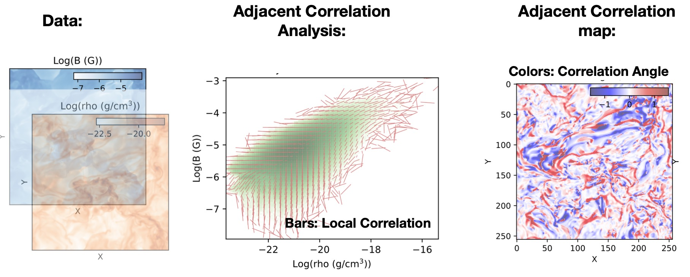

.. Adjacent-Correlation-Analysis documentation master file, created by
   sphinx-quickstart on Sun Jun  1 16:04:03 2025.
   You can adapt this file completely to your liking, but it should at least
   contain the root `toctree` directive.

Adjacent-Correlation-Analysis documentation
===========================================

Welcome to the Adjacent-Correlation-Analysis documentation!

.. toctree::
   :maxdepth: 2
   :caption: Contents:

   concept.rst
   installation.rst
   adjacent_correlation_mapping.rst
   adjacent_correlation_analysis.rst
   interactive.rst
   credit.rst

Features & Design
------------------
A Python package for performing adjacent correlation analysis on image data. 

The input are images 1 and image 2, in the form of Numpy arrays of the same size. The method is designed to reveal regularities by comparing these images through correlations.

The *adjacent correlation analysis* is performed by calculating and visualizing the *adjacency-induced correlation* in the phase space. The *adjacent correlation map* is a spatially-resolved representation of the correlation between the two images.

The methods are designed to represent the data using correlations, which can be used to perform visualization and interactive data explorations. 

.. _adjacency-correlation-analysis:

------------------------------
Adjacent Correlation Analysis
------------------------------

The  *adjacent correlation analysis* is a method to derive correlation vectors,  which can be plotted on 
top of the density map representing the Probably Density Function (PDF) of the two images data. 

.. image:: _static/pdf_aca.png
   :alt: Example of adjacent correlation analysis
   :align: center
   :width: 500px

**The adjacent correlation analysis applied to data from MHD turbulence simulation.**  The output consists of a correlation vector field overlaid on the density map (density PDF). The correlation degree is the normalized length of the vector, and the both the length and the orientation of the vector can be seen in the *adjacent correlation plot*.

.. image:: _static/pdf_aca_lorentz.png
   :alt: Example of adjacent correlation analysis
   :align: center
   :width: 500px

**The adjacent correlation analysis applied to the Lorentz system.**  The vectors derived using the adjacent correlation analysis reflects a projected view of the vector field in the phase space on the x-y plane. 

