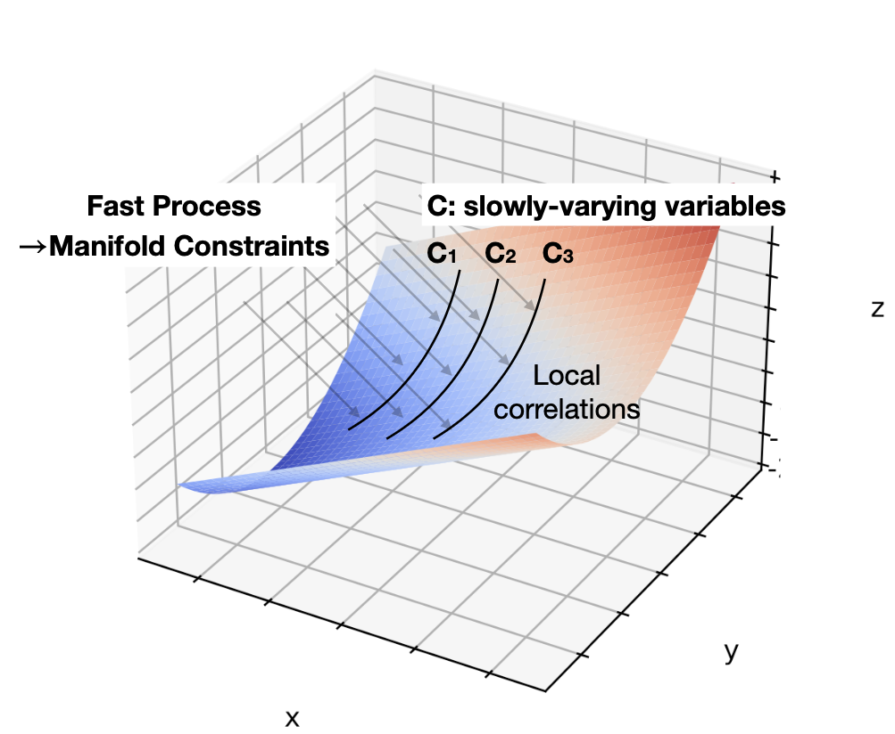

Manifold Interpretation
*************************

What do the lines seen in the adjacent correlation plot mean?

For a system controlled by a series of PDEs, a fast process will restrict the system to a low-dimensional manifold in the phase space, where the local variations can be described by a (spin-2) vector field on this manifold. The existence of some slow variables (C) might serve the role of separating different trajectories, which correspond to different spatially coherent regions. 

Consider the correlation between income and the size of the apartment, when measured in a localized regions, families with larger income tend to live in larger apartments, and visa versa. However, when considering the whole country, the correlation between income and apartment size is weak. This is because the size of the apartment is not only a function of the income, but also depends on other hidden parameters, such as GDP per capita, city, size, etc... This hidden, slow-changing parameters, when not measured, can induce these local correlations.

*The correlation vectors thus follow lines of constant C, where C is a hidden, slow-varying parameter.*

