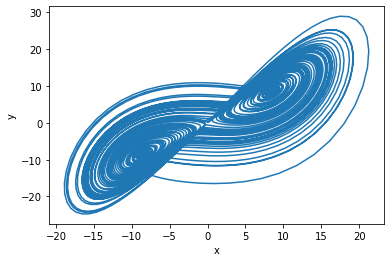

Time Series Example
********************

The *adjacent correlation analysis* can also be used to construct phase
plot using time series

.. code:: ipython3

    import adjacent_correlation_analysis as aca
    import numpy as np
    import matplotlib.pyplot as plt
    import wget
    
    # load the data
    url = "https://github.com/gxli/Adjacent-Correlation-Analysis/blob/main/tests/lorentz_x.npy"
    wget.download(url)
    url = "https://github.com/gxli/Adjacent-Correlation-Analysis/blob/main/tests/lorentz_y.npy"
    wget.download(url)

    
    x = np.load('lorentz_x.npy')
    y = np.load('lorentz_y.npy')

.. code:: ipython3

    # Plotting the data
    plt.subplot(211)
    plt.plot(x)
    plt.subplot(212)
    plt.plot(y)

.. code:: ipython3

    # plotting the data in the phase space
    plt.plot(x,y)
    plt.xlabel('x')
    plt.ylabel('y')
    plt.show()

.. code:: ipython3

    # using the adjacent correlation analysis
    
    aca.adjacent_correlation_plot(x, y,50,cmap='viridis_r',scale=30)
    plt.show()

.. image:: ./_static/time_series/output_4_1.png

