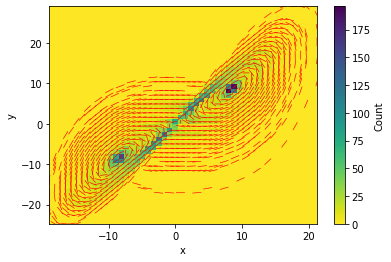

#Adjacent Correlation Analysis on Time Series

The *adjacent correlation asnalysis* can also be used to construct phase
plot using time series

.. code:: ipython3

    import adjacent_correlation_analysis as aca
    import numpy as np
    import matplotlib.pyplot as plt
    
    # load the data
    
    x = np.load('tests/lorentz_x.npy')
    y = np.load('tests/lorentz_y.npy')

.. code:: ipython3

    # Plotting the data
    plt.subplot(211)
    plt.plot(x)
    plt.subplot(212)
    plt.plot(y)

.. parsed-literal::

    [<matplotlib.lines.Line2D at 0x1268735b0>]

.. image:: output_2_1.png

.. code:: ipython3

    # plotting the data in the phase space
    plt.plot(x,y)
    plt.xlabel('x')
    plt.ylabel('y')
    plt.show()

.. image:: output_3_0.png

.. code:: ipython3

    # using the adjacent correlation analysis
    
    aca.adjacent_correlation_plot(x, y,50,cmap='viridis_r',scale=30)
    plt.show()

.. parsed-literal::

    /Users/gxli/proj/GitHub/Adjacent_Correlation_Analysis/adjacent_correlation_analysis/analysis.py:101: RuntimeWarning: invalid value encountered in divide
      p = np.sqrt(q**2 + u**2) / i

